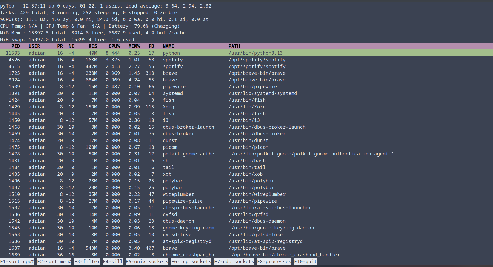

# pyTop - Custom System Monitor

A feature-rich, interactive system monitoring tool inspired by the Linux "top" command, but with enhanced functionality and a user-friendly terminal UI.

## Features

- **Real-time System Monitoring**: Tracks CPU usage, memory usage, process information, and more
- **Multi-threaded Design**: Responsive UI with separate threads for menu and footer management
- **Interactive Interface**: Keyboard shortcuts for sorting, filtering, and process management
- **Flexible Process Views**: Sort processes by CPU usage or memory consumption
- **Process Management**: Kill processes directly from the interface
- **Network Connection Monitoring**: View active network connections
- **Hardware Monitoring**: Displays CPU temperature, GPU temperature, fan speeds, and battery status
- **User Filtering**: Filter processes by specific users
- **Resource Usage Statistics**: Detailed information about memory and swap usage
- **System Load Analysis**: Load averages and uptime information

<br>




## Requirements

- Python 3.6+
- Required Python packages:
  - `psutil` - For system and process information
  - `curses` - For terminal UI
  - `pynvml` - For NVIDIA GPU information (optional)

## Installation

1. Clone the repository
   ```bash
   git clone https://github.com/aptGetAdrian/pyTop.git
   cd pyTop
   ```

2. Install dependencies
   ```bash
   pip install -r requirements.txt
   ```

## Usage

Run the program with:
```bash
python pytop.py
```

If you want to see the processes ran by the system, you can run it as a root user. This assumes you're using Linux as your OS:
```bash
sudo python pytop.py
```

### Keyboard shortcuts

| Key | Function |
|-----|----------|
| F1 | Sort processes by CPU percentage |
| F2 | Sort processes by memory percentage |
| F3 | Filter processes by user |
| F4 | Kill a process (prompts for process name/path) |
| F5 | Show Unix sockets |
| F6 | Show TCP sockets |
| F7 | Show UDP sockets |
| F8 | Return to process monitor view |
| F10 | Exit the application |

## Technical details

### Displayed process information

- PID (Process ID)
- Username (owner of the process)
- PR (Priority)
- NI (Nice value)
- RES (Resident memory size)
- CPU% (CPU usage percentage)
- MEM% (Memory usage percentage)
- FD (File descriptor count)
- Name (Process name)
- Path (Full path to executable)

### Network information

- **Unix Sockets**: PID, file descriptor, and path
- **TCP Connections**: PID, type, local address, remote address, and connection status
- **UDP Connections**: PID, type, local address, and remote address

### Hardware information

- CPU temperature
- GPU temperature and fan speed (for NVIDIA GPUs)
- Battery status and charge percentage

## Known issues

- Temperature sensors might display "N/A" if sensor drivers are not properly configured in your system
- NVIDIA GPU monitoring requires proper installation of NVIDIA drivers and the NVML library
- Threading implementation lacking safety and optimization 

## Future plans

- I/O statistics for processes
- Process CPU time analysis
- Try to switch from threads to Asyncio

<br><br>

A more detailed description, albeit in Slovenian, can be found in the `poročilo.pdf` file.
